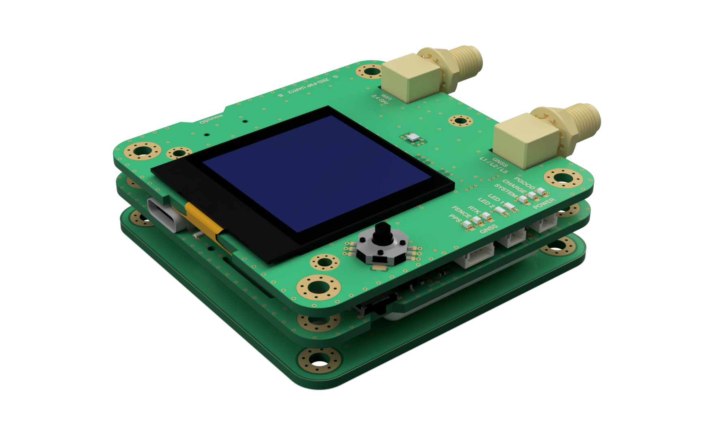

# [GNSS (GitHub) Rev. B](https://github.com/FranzImsch/gnss)

# Abstract

[ZED-F9P](https://www.u-blox.com/sites/default/files/ZED-F9P-04B_DataSheet_UBX-21044850.pdf)-based GNSS dev board with [ISM330DHCX]() 6-DoF IMU, [BMM150]() Magnetometer and [DPS310](https://www.infineon.com/dgdl/Infineon-DPS310-DS-v01_00-EN.pdf?fileId=5546d462576f34750157750826c42242) pressure sensor.

As a basic UI, the OLED (1.5") can be used along with a navigation switch, more advanced usage requires a web interface. The device features a microSD card reader for data logging.

The ESP32 is used as the microcontroller because of its WiFi and Bluetooth capability that enables data to be streamed onto a device (phone, tablet, …) wirelessly.

The component selection is partly influenced by the semiconductor shortage.

```Work in progress!```  
To Do:
- Extensive testing
- Documentation
- Software

[](https://a360.co/38VXSXv)

# Hardware

## Changelog (Rev A to B)

* Added LiPo battery to enable standalone operation
* Replaced BNO055 with ISM330DHCX and BMM150 due to their superior performance
* Removed SHT40 as the first revision revealed that the board heats up too much for temperature or humidity measurement (Can be added via exposed i2c connector)
* Added USB hub to board
* Protected ZED a bit more against electrical damage (isolating and filtering IO, LDO as power supply)
* many minor improvements

## Documentation and Resources

[Schematic](https://franz.science/gnss/Schematic.pdf)\
[iBom PCB #1](https://franz.science/gnss/PCB-1/bom/index.html)\
[iBom PCB #2](https://franz.science/gnss/PCB-2/bom/index.html)

[3D model](https://a360.co/38VXSXv)

---

# Licence

Copyright Franz Imschweiler 2022.

This source describes Open Hardware and is licensed under the CERN-OHL-S v2 or any later version. You may redistribute and modify this source and make products using it under the terms of the CERN-OHL-S v2 or any later version (https://ohwr.org/cern\_ohl\_s\_v2.txt).

This source is distributed WITHOUT ANY EXPRESS OR IMPLIED WARRANTY, INCLUDING OF MERCHANTABILITY, SATISFACTORY QUALITY AND FITNESS FOR A PARTICULAR PURPOSE. Please see the CERN-OHL-S v2 for applicable conditions.

Source location: https://github.com/FranzImsch/gnss

As per CERN-OHL-S v2 section 4, should You produce hardware based on this source, You must where practicable maintain the Source Location visible on the external case of the GNSS Receiver or other products you make using this source.

---