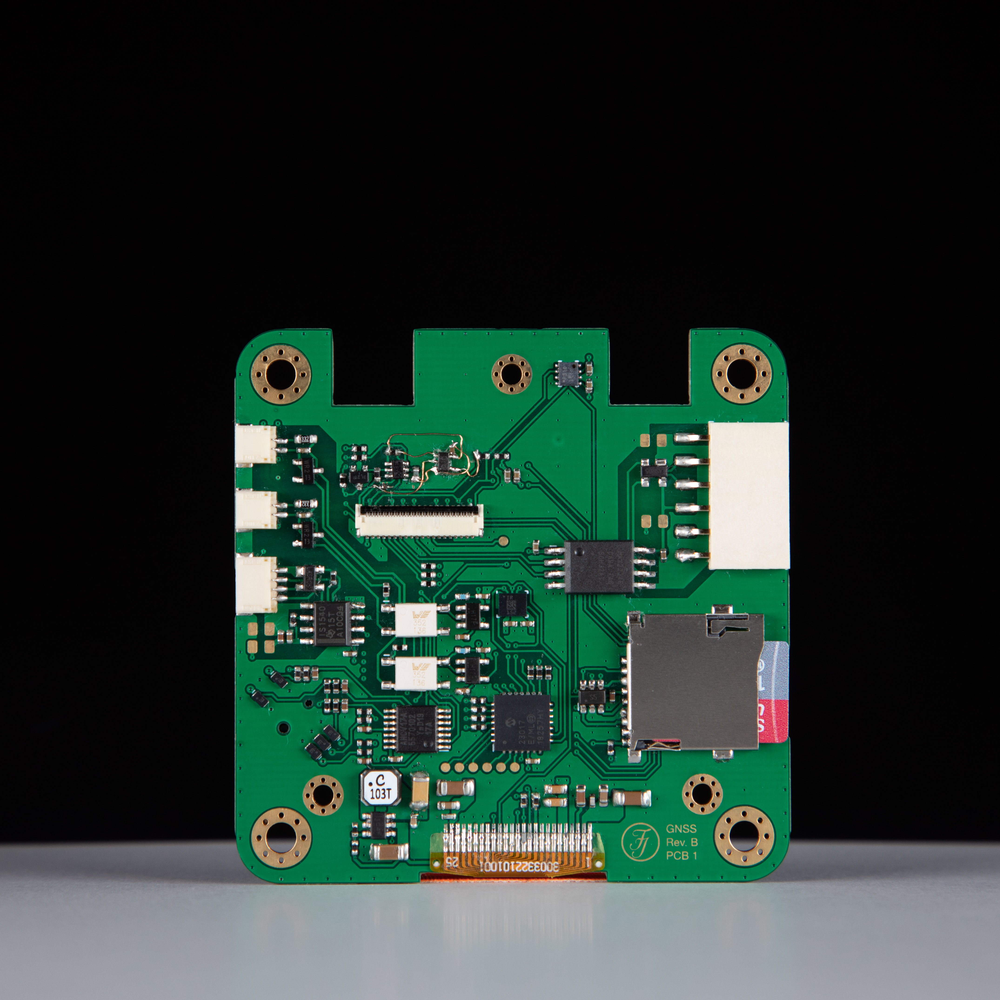

# [GNSS Rev. B](https://github.com/FranzImsch/gnss)

# Overview

[ZED-F9P](https://www.u-blox.com/sites/default/files/ZED-F9P-04B_DataSheet_UBX-21044850.pdf)\-based GNSS dev board with [ISM330DHCX](https://www.st.com/resource/en/datasheet/ism330dhcx.pdf) 6-DoF IMU, [BMM150](https://www.bosch-sensortec.com/media/boschsensortec/downloads/datasheets/bst-bmm150-ds001.pdf) Magnetometer and [DPS310](https://www.infineon.com/dgdl/Infineon-DPS310-DS-v01_00-EN.pdf?fileId=5546d462576f34750157750826c42242) pressure sensor.

As a basic UI, the OLED (1.5") can be used along with a navigation switch, more advanced usage requires a web interface. The device features a microSD card reader for data logging.

The ESP32 is used as the microcontroller because of its WiFi and Bluetooth capability that enables data to be streamed onto a device (phone, tablet, …) wirelessly.

The component selection is partly influenced by the semiconductor shortage. The software is yet to be worked on and also the documentation should receive some attention.

# Hardware

The device consists of a stackup of three PCBs. A detailed view is provided by the [3D-model](https://a360.co/38VXSXv). The third PCB is not relevant for the function, as it only serves as a mounting piece for the battery.

 The uppermost PCB of the stackup is where the OLED is mounted along with the navigation switch and some status LEDs. The photo shows the backside of this PCB with the IO ports and their isolation. Also found here is the barometric pressure sensor (top), a port expander and the 12V step-up converter for the OLED. One may ignore the little bodge at the top. :)

 The picture shows the main PCB where the ZED module is located (right-hand side). On the left the ESP32 module can be found along with the FTDI chips for both the ESP and the UART1 port of the ZED-F9P. The bottom left is where the USB hub chip is placed. On the bottom-right there is the power section, consisting of a step-down converter, a power path manager, a fuel gauge for the battery and some super low-noise LDOs for the ZED-F9P.

## Battery

The function of the battery circuitry was tested extensively and no issues were found. The device correctly stops power when the cutoff voltage is reaced (3.2 V, depends on the voltage supervisor). During charging, the unit does not exceed ca. 60°C at the hottest point (which is the power path IC).

## Documentation and Resources

[Schematic](https://franz.science/gnss/Schematic.pdf)  
[iBom PCB #1](https://franz.science/gnss/PCB-1/bom/index.html)  
[iBom PCB #2](https://franz.science/gnss/PCB-2/bom/index.html)

[3D model](https://a360.co/38VXSXv)

## Changelog (Rev A to B)

* Added LiPo battery to enable standalone operation
* Replaced BNO055 with ISM330DHCX and BMM150 due to their superior performance
* Removed SHT40 as the first revision revealed that the board heats up too much for temperature or humidity measurement (Can be added via exposed i2c connector)
* Added USB hub to board
* Protected ZED a bit more against electrical damage (isolating and filtering IO, LDO as power supply)
* many minor improvements

# GNSS in General

Useful literature:

* https://doi.org/10.1007/978-3-211-73017-1
* https://content.u-blox.com/sites/default/files/products/documents/GPS-Compendium_Book\_(GPS-X-02007).pdf?hash=undefined

---

# Licence

Copyright Franz Imschweiler 2022.

This source describes Open Hardware and is licensed under the CERN-OHL-S v2 or any later version. You may redistribute and modify this source and make products using it under the terms of the CERN-OHL-S v2 or any later version (https://ohwr.org/cern_ohl_s_v2.txt).

This source is distributed WITHOUT ANY EXPRESS OR IMPLIED WARRANTY, INCLUDING OF MERCHANTABILITY, SATISFACTORY QUALITY AND FITNESS FOR A PARTICULAR PURPOSE. Please see the CERN-OHL-S v2 for applicable conditions.

Source location: https://github.com/FranzImsch/gnss

As per CERN-OHL-S v2 section 4, should You produce hardware based on this source, You must where practicable maintain the Source Location visible on the external case of the GNSS Receiver or other products you make using this source.

---